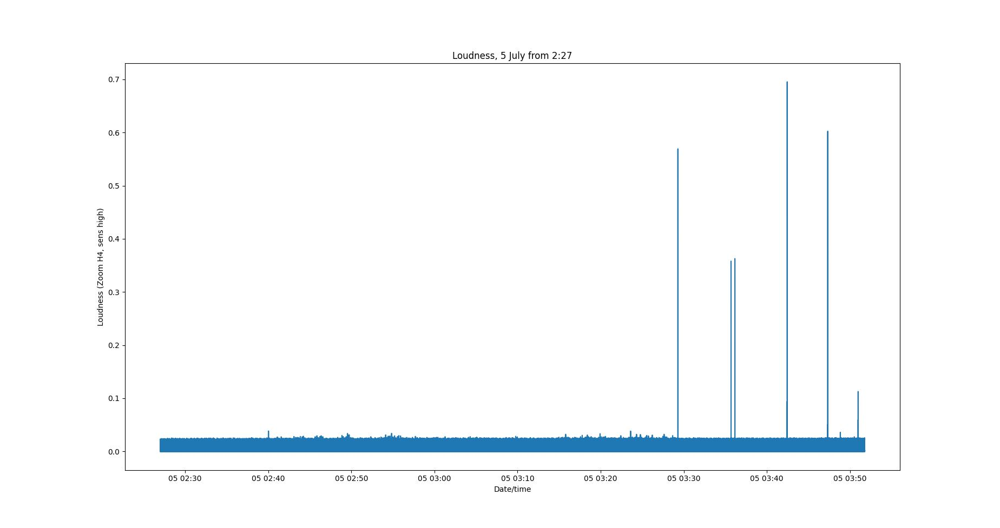
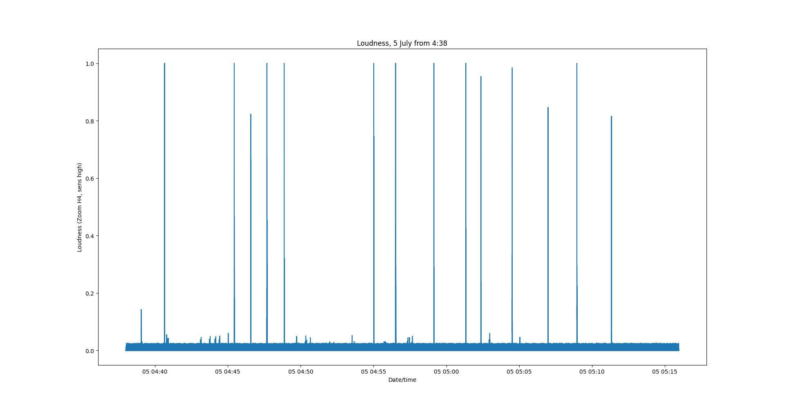

# noisy_neighbour

Noise levels in flat 1/1 measured with a zoom H4 ambient sound
recorder. Sensitivity set to "high" (=night time).

Every peak represents an exercise weight hitting the floor.

## Sound levels from 2:27am before the police visited

6 times a "thud" was heard

## Sound levels from 4:38am after the police visit

*Constantly* throwing exercise weights on the floor with
much higher intensity so that the recorder went *off scale* (=1).

