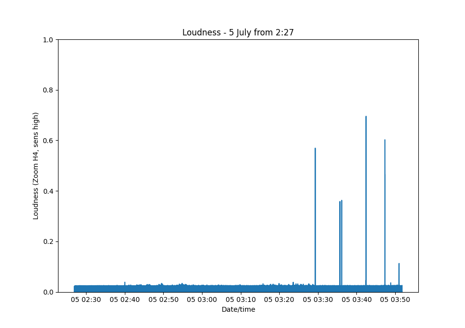
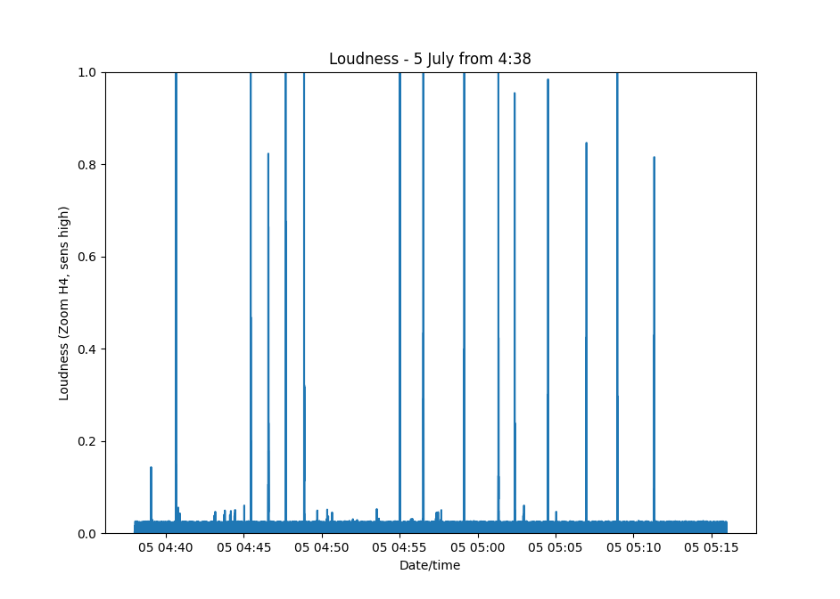
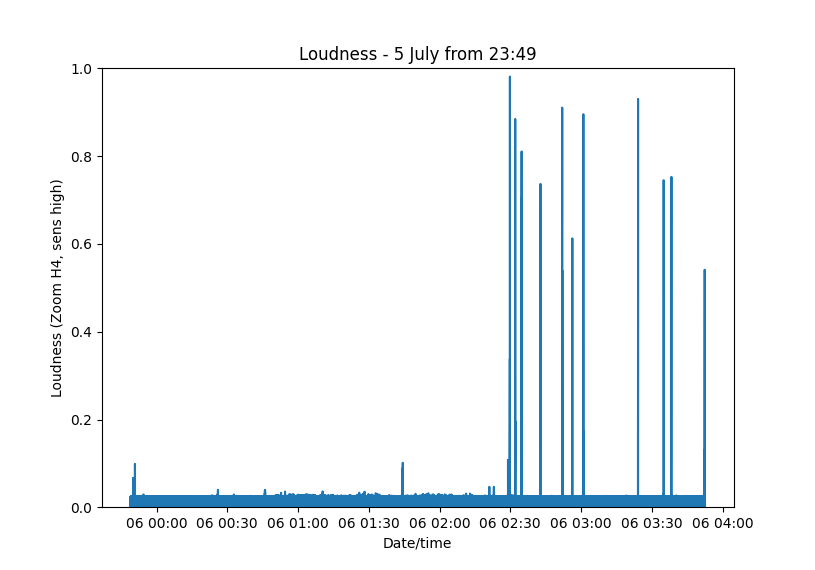
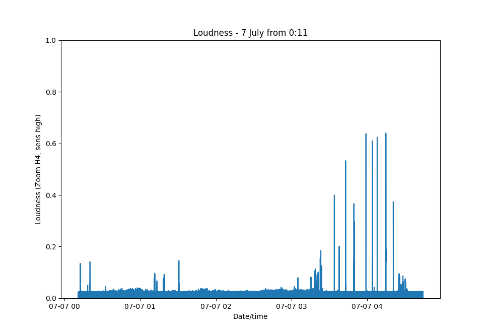
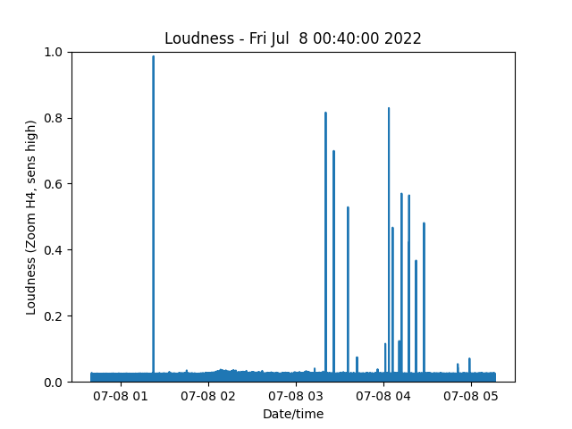
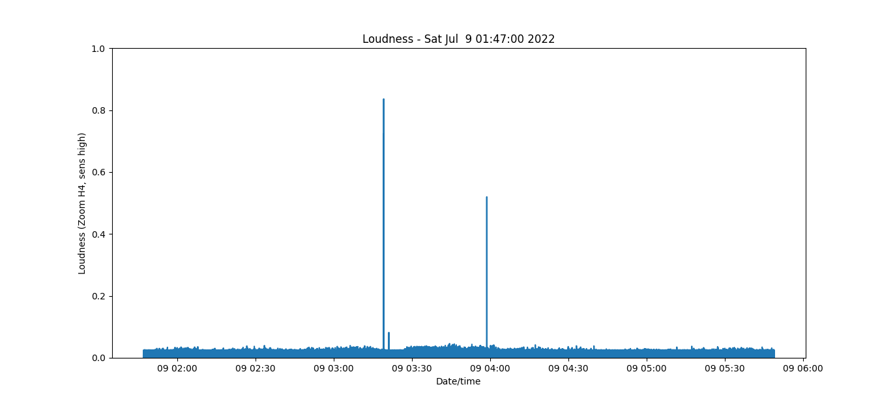
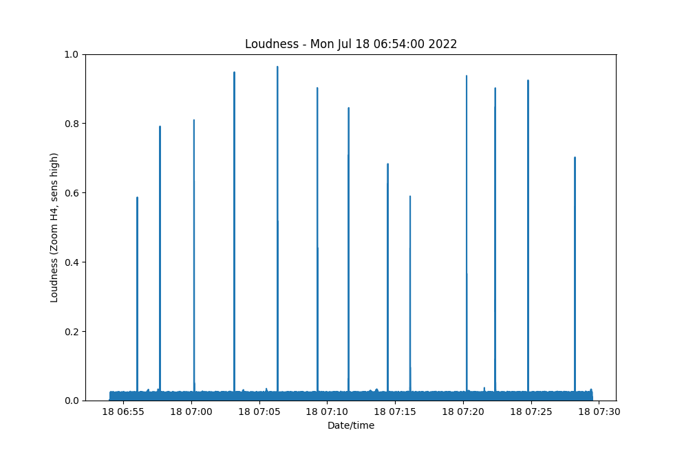
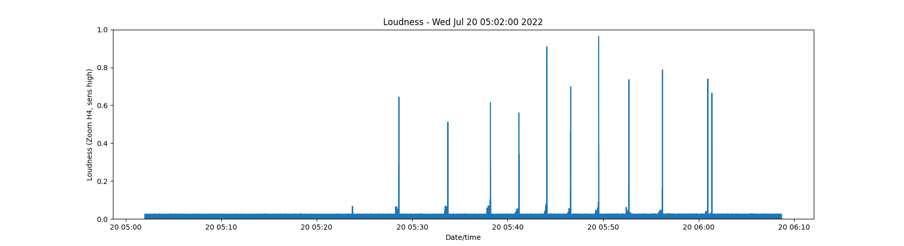
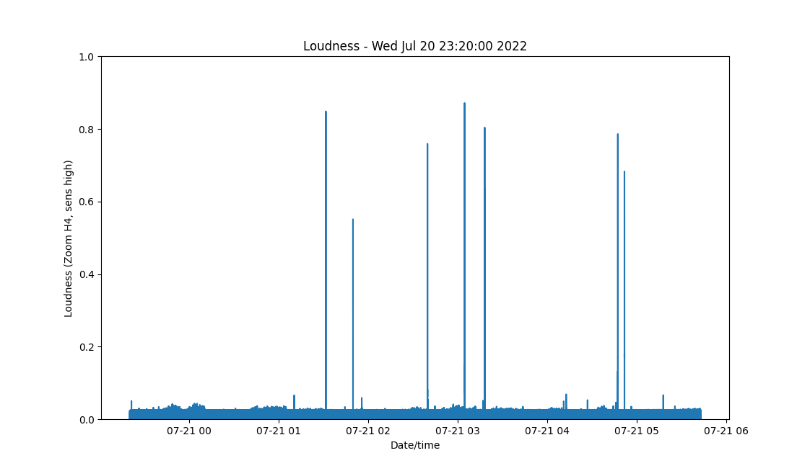

# Noisy Neighbour

Neighbour moved in and listened to max volume all night to
podcasts about spirituality, global warming
and self care while pumping weights.

A "best of" here: https://youtu.be/hyjDLyST_qQ

Then the police confiscated his TV & stereo. 

Without a TV & stereo he resorted terrorising the house by dropping
exercise weights which can even be felt on the street.

I started measuring the noise levels in my flat 1/1 with a zoom H4 ambient sound
recorder and wrote a python script detecting the "thuds". Sensitivity at the zoom set to "high" (=night time).

Every peak represents an exercise weight hitting the floor in flat 0/1 below.

# 5th July

## Sound levels from 2:27am *before* the police visited him



Six "thuds" can be heard at:
```
Thud #1 at 2022-07-05 03:29:17.704000
Thud #2 at 2022-07-05 03:35:41.230000
Thud #3 at 2022-07-05 03:36:09.062000
Thud #4 at 2022-07-05 03:42:26.758000
Thud #5 at 2022-07-05 03:47:19.490000
Thud #6 at 2022-07-05 03:50:59.026000
```

## Sound levels from 4:38am *after* the police visited him

*Constantly* throwing exercise weights on the floor with
much higher intensity so that the recorder went *off scale* (=1).



15 "thuds" can be heard at:
```
Thud #1 at 2022-07-05 04:39:03.480000
Thud #2 at 2022-07-05 04:40:39.554000
Thud #3 at 2022-07-05 04:45:26.616000
Thud #4 at 2022-07-05 04:46:34.620000
Thud #5 at 2022-07-05 04:47:41.088000
Thud #6 at 2022-07-05 04:48:52.190000
Thud #7 at 2022-07-05 04:55:00.964000
Thud #8 at 2022-07-05 04:56:31.194000
Thud #9 at 2022-07-05 04:59:08.744000
Thud #10 at 2022-07-05 05:01:20.080000
Thud #11 at 2022-07-05 05:02:22.460000
Thud #12 at 2022-07-05 05:04:31.166000
Thud #13 at 2022-07-05 05:06:58.936000
Thud #14 at 2022-07-05 05:08:57.520000
Thud #15 at 2022-07-05 05:11:19.898000
```

# 6th July

It was all quiet till exactly 2:30am in the morning and then the
weights started hitting the ground (continues longer than the 1 1/2
hrs but can't be bothered to add the other files).



```
Thud #1 at 2022-07-06 02:29:50.632000
Thud #2 at 2022-07-06 02:32:05.804000
Thud #3 at 2022-07-06 02:34:48.706000
Thud #4 at 2022-07-06 02:42:47.756000
Thud #5 at 2022-07-06 02:52:01.340000
Thud #6 at 2022-07-06 02:56:18.606000
Thud #7 at 2022-07-06 03:00:59.634000
Thud #8 at 2022-07-06 03:24:10.868000
Thud #9 at 2022-07-06 03:35:02.558000
Thud #10 at 2022-07-06 03:38:20.434000
Thud #11 at 2022-07-06 03:52:26.458000
```

# 7th July

Probably so far the most disturbing night: 1st some constant hammering while he
was walking throught the flat, then loads of thuds with heavy weights hitting
the floor and then again constant hammering while walking around (even to the main door).



## Constant hammering sounds at 3:15am & 4:25am

Loads of "thuds" (with a hammer???) every few seconds around 3:15am
and 4:25am.

[4:25am: MP3 / Sound recording with the hammer-sounds where he walks
through the flat while hammering walls/floor,
then goes to the main door and hammers
against that so that the whole close echoes the hammering sound (at 4:25 into the recording) and
then goes back into the flat continues hammering.](<./flat11-7juj_4_25am.mp3>).

```
Thud #1 at 2022-07-07 00:12:29.192000
Thud #2 at 2022-07-07 00:12:31.932000
Thud #3 at 2022-07-07 00:20:14.184000
Thud #4 at 2022-07-07 01:11:03.898000
Thud #5 at 2022-07-07 01:11:08.710000
Thud #6 at 2022-07-07 01:11:14.424000
Thud #7 at 2022-07-07 01:11:26.804000
Thud #8 at 2022-07-07 01:11:27.830000
Thud #9 at 2022-07-07 01:11:29.138000
Thud #10 at 2022-07-07 01:11:30.482000
Thud #11 at 2022-07-07 01:11:31.812000
Thud #12 at 2022-07-07 01:11:33.116000
Thud #13 at 2022-07-07 01:11:34.514000
Thud #14 at 2022-07-07 01:11:38.108000
Thud #15 at 2022-07-07 01:11:39.580000
Thud #16 at 2022-07-07 01:11:41.652000
Thud #17 at 2022-07-07 01:11:43.016000
Thud #18 at 2022-07-07 01:11:44.364000
Thud #19 at 2022-07-07 01:11:48.792000
Thud #20 at 2022-07-07 01:13:18.258000
Thud #21 at 2022-07-07 01:18:30.436000
Thud #22 at 2022-07-07 01:18:37.446000
Thud #23 at 2022-07-07 01:18:44.262000
Thud #24 at 2022-07-07 01:18:47.718000
Thud #25 at 2022-07-07 01:18:49.738000
Thud #26 at 2022-07-07 01:18:55.982000
Thud #27 at 2022-07-07 01:18:58.976000
Thud #28 at 2022-07-07 01:19:01.928000
Thud #29 at 2022-07-07 01:19:03.272000
Thud #30 at 2022-07-07 01:19:06.162000
Thud #31 at 2022-07-07 01:19:08.276000
Thud #32 at 2022-07-07 01:19:09.684000
Thud #33 at 2022-07-07 01:30:42.244000
Thud #34 at 2022-07-07 03:05:02.450000
Thud #35 at 2022-07-07 03:15:23.430000
Thud #36 at 2022-07-07 03:18:10.234000
Thud #37 at 2022-07-07 03:18:13.524000
Thud #38 at 2022-07-07 03:18:15.896000
Thud #39 at 2022-07-07 03:18:18.754000
Thud #40 at 2022-07-07 03:18:22.192000
Thud #41 at 2022-07-07 03:18:23.626000
Thud #42 at 2022-07-07 03:18:25.022000
Thud #43 at 2022-07-07 03:18:27.958000
Thud #44 at 2022-07-07 03:18:29.430000
Thud #45 at 2022-07-07 03:18:30.822000
Thud #46 at 2022-07-07 03:18:31.900000
Thud #47 at 2022-07-07 03:18:39.526000
Thud #48 at 2022-07-07 03:18:45.596000
Thud #49 at 2022-07-07 03:18:47.210000
Thud #50 at 2022-07-07 03:18:48.724000
Thud #51 at 2022-07-07 03:18:50.168000
Thud #52 at 2022-07-07 03:18:51.652000
Thud #53 at 2022-07-07 03:18:53.104000
Thud #54 at 2022-07-07 03:20:14.110000
Thud #55 at 2022-07-07 03:20:16.312000
Thud #56 at 2022-07-07 03:20:19.472000
Thud #57 at 2022-07-07 03:20:23.250000
Thud #58 at 2022-07-07 03:20:24.772000
Thud #59 at 2022-07-07 03:20:26.342000
Thud #60 at 2022-07-07 03:20:56.842000
Thud #61 at 2022-07-07 03:20:58.406000
Thud #62 at 2022-07-07 03:21:01.492000
Thud #63 at 2022-07-07 03:21:03.976000
Thud #64 at 2022-07-07 03:21:13.098000
Thud #65 at 2022-07-07 03:21:25.138000
Thud #66 at 2022-07-07 03:21:26.792000
Thud #67 at 2022-07-07 03:22:43.368000
Thud #68 at 2022-07-07 03:23:11.532000
Thud #69 at 2022-07-07 03:23:45.984000
Thud #70 at 2022-07-07 03:33:55.504000
Thud #71 at 2022-07-07 03:37:43.442000
Thud #72 at 2022-07-07 03:42:50.374000
Thud #73 at 2022-07-07 03:49:23.418000
Thud #74 at 2022-07-07 03:49:43.280000
Thud #75 at 2022-07-07 03:58:59.754000
Thud #76 at 2022-07-07 04:04:10.052000
Thud #77 at 2022-07-07 04:07:52.048000
Thud #78 at 2022-07-07 04:14:46.520000
Thud #79 at 2022-07-07 04:20:37.888000
Thud #80 at 2022-07-07 04:24:59.788000
Thud #81 at 2022-07-07 04:25:04.096000
Thud #82 at 2022-07-07 04:25:06.236000
Thud #83 at 2022-07-07 04:25:09.850000
Thud #84 at 2022-07-07 04:25:11.298000
Thud #85 at 2022-07-07 04:25:12.788000
Thud #86 at 2022-07-07 04:25:14.216000
Thud #87 at 2022-07-07 04:25:15.710000
Thud #88 at 2022-07-07 04:25:18.478000
Thud #89 at 2022-07-07 04:25:20.792000
Thud #90 at 2022-07-07 04:25:22.950000
Thud #91 at 2022-07-07 04:25:26.614000
Thud #92 at 2022-07-07 04:25:28.466000
Thud #93 at 2022-07-07 04:25:30.072000
Thud #94 at 2022-07-07 04:25:39.598000
Thud #95 at 2022-07-07 04:25:40.914000
Thud #96 at 2022-07-07 04:25:43.034000
Thud #97 at 2022-07-07 04:25:44.430000
Thud #98 at 2022-07-07 04:27:50.340000
Thud #99 at 2022-07-07 04:28:09.618000
Thud #100 at 2022-07-07 04:28:13.524000
Thud #101 at 2022-07-07 04:28:17.714000
Thud #102 at 2022-07-07 04:28:20.572000
Thud #103 at 2022-07-07 04:29:59.210000
Thud #104 at 2022-07-07 04:30:00.550000
Thud #105 at 2022-07-07 04:30:07.328000
Thud #106 at 2022-07-07 04:30:08.866000
Thud #107 at 2022-07-07 04:30:14.244000
Thud #108 at 2022-07-07 04:30:15.636000
Thud #109 at 2022-07-07 04:30:19.614000
```

# 8 July 2022



Massive bang right at the start of the night which went off scale
but at that time I was still working. Then the "usual"
thuds from 3:20am in the morning.

```
Thud #1 at 2022-07-08 01:22:21.136000
Thud #2 at 2022-07-08 03:20:22.126000
Thud #3 at 2022-07-08 03:25:56.060000
Thud #4 at 2022-07-08 03:35:39.130000
Thud #5 at 2022-07-08 03:41:50.552000
Thud #6 at 2022-07-08 03:41:52.276000
Thud #7 at 2022-07-08 04:01:13.426000
Thud #8 at 2022-07-08 04:03:38.580000
Thud #9 at 2022-07-08 04:06:17.028000
Thud #10 at 2022-07-08 04:10:44.936000
Thud #11 at 2022-07-08 04:12:22.974000
Thud #12 at 2022-07-08 04:17:31.916000
Thud #13 at 2022-07-08 04:22:18.608000
Thud #14 at 2022-07-08 04:27:45.174000
Thud #15 at 2022-07-08 04:58:54.552000
```

# 9 July 2022



Only a few loud thuds through the night. Woken up "just" twice!

```
Thud #1 at 2022-07-09 03:19:09.416000
Thud #2 at 2022-07-09 03:21:06.714000
Thud #3 at 2022-07-09 03:21:08.778000
Thud #4 at 2022-07-09 03:58:42.212000
```

# 9 July - 17 July

Quality time away catching up on sleep

# 18 July 2022

Back in Glasgow.

From 4am he did some DIY with a hammer: [a couple of audio clips](<./nn18jul.mp4>)

The weight-dropping started at about 6:30am (but had to swap battery so missed the start).



```
Thud #1 at 2022-07-18 06:56:01.758000
Thud #2 at 2022-07-18 06:57:42.116000
Thud #3 at 2022-07-18 07:00:12.144000
Thud #4 at 2022-07-18 07:03:10.160000
Thud #5 at 2022-07-18 07:06:20.526000
Thud #6 at 2022-07-18 07:09:16.728000
Thud #7 at 2022-07-18 07:11:35.116000
Thud #8 at 2022-07-18 07:14:27.904000
Thud #9 at 2022-07-18 07:16:06.112000
Thud #10 at 2022-07-18 07:20:15.508000
Thud #11 at 2022-07-18 07:22:22.164000
Thud #12 at 2022-07-18 07:24:46.998000
Thud #13 at 2022-07-18 07:28:13.990000
```

# 19 July

All quiet. I guess pumping weights during the heatwave even at 4am is too much.

# 20 July

Exercise weights started hitting the floor at 5:28am with first
quick banging (against a wall?) and then something heavy dropping on the floor.

Then that's repeated 10 times till 6am.



```
Thud #1 at 2022-07-20 05:23:44.804000
Thud #2 at 2022-07-20 05:28:16.230000
Thud #3 at 2022-07-20 05:28:22.318000
Thud #4 at 2022-07-20 05:28:35.546000
Thud #5 at 2022-07-20 05:28:36.810000
Thud #6 at 2022-07-20 05:33:28.560000
Thud #7 at 2022-07-20 05:33:29.568000
Thud #8 at 2022-07-20 05:33:34.586000
Thud #9 at 2022-07-20 05:33:36.644000
Thud #10 at 2022-07-20 05:33:37.644000
Thud #11 at 2022-07-20 05:33:40.800000
Thud #12 at 2022-07-20 05:33:42.896000
Thud #13 at 2022-07-20 05:33:44.016000
Thud #14 at 2022-07-20 05:37:57.812000
Thud #15 at 2022-07-20 05:38:00.870000
Thud #16 at 2022-07-20 05:38:05.028000
Thud #17 at 2022-07-20 05:38:06.100000
Thud #18 at 2022-07-20 05:38:07.170000
Thud #19 at 2022-07-20 05:38:08.226000
Thud #20 at 2022-07-20 05:38:10.440000
Thud #21 at 2022-07-20 05:38:11.460000
Thud #22 at 2022-07-20 05:41:10.370000
Thud #23 at 2022-07-20 05:43:59.394000
Thud #24 at 2022-07-20 05:44:02.646000
Thud #25 at 2022-07-20 05:44:04.948000
Thud #26 at 2022-07-20 05:44:05.948000
Thud #27 at 2022-07-20 05:46:34.382000
Thud #28 at 2022-07-20 05:46:35.404000
Thud #29 at 2022-07-20 05:46:36.404000
Thud #30 at 2022-07-20 05:49:29.072000
Thud #31 at 2022-07-20 05:49:31.116000
Thud #32 at 2022-07-20 05:49:32.120000
Thud #33 at 2022-07-20 05:52:25.190000
Thud #34 at 2022-07-20 05:52:41.906000
Thud #35 at 2022-07-20 05:56:11.840000
Thud #36 at 2022-07-20 05:56:12.988000
Thud #37 at 2022-07-20 06:00:56.322000
Thud #38 at 2022-07-20 06:00:57.440000
Thud #39 at 2022-07-20 06:01:23.170000
```

[Example MP3 of one of these slowly building up thuds till the final massive bang](<./STE-20Jul_sample_thud.mp3>) -- Listen with headphones as it sounds like a basedrum being kicked.

# 21 July



Thuds spaced perfectly over the entire night. Every single one woke me up.

```
Thud #1 at 2022-07-21 01:31:33.398000
Thud #2 at 2022-07-21 01:49:45.482000
Thud #3 at 2022-07-21 02:39:43.320000
Thud #4 at 2022-07-21 03:04:39.032000
Thud #5 at 2022-07-21 03:18:06.966000
Thud #6 at 2022-07-21 04:47:26.492000
Thud #7 at 2022-07-21 04:51:53.104000
```

## Sound files

Original recordings were at 44kHz sampling rate.

To be able to load the 6hr WAV into python it was downsampled to
500Hz sampling rate to focus on the low base frequencies or "thuds".
For example:

```
sox STE-038_2_27_5jul.wav -c 1 -r 500 STE-038_2_27_5jul_500Hz.wav
```
